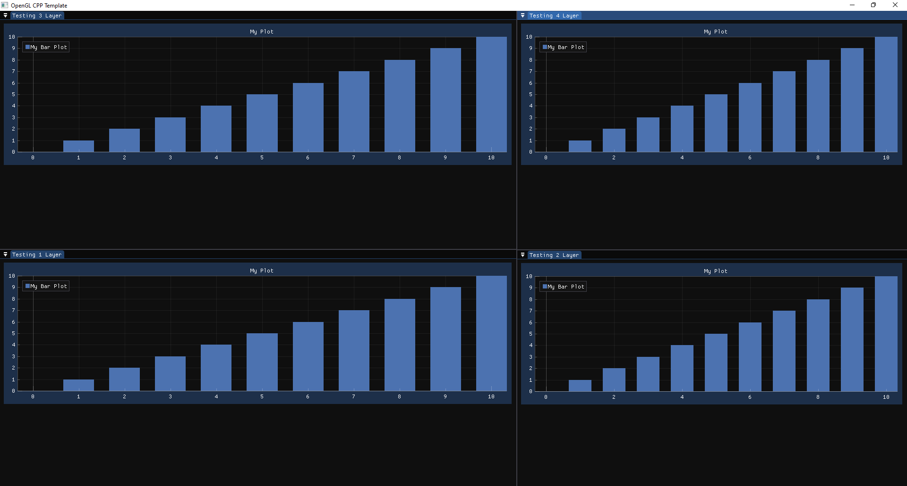
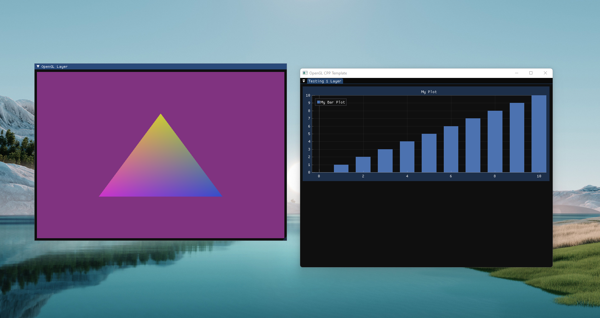
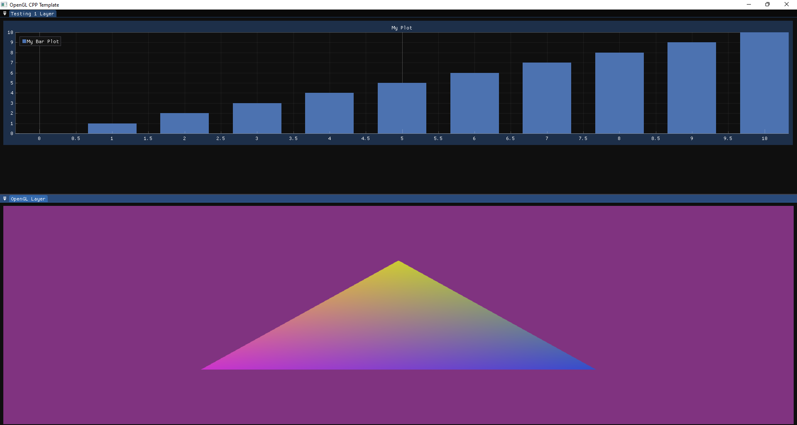
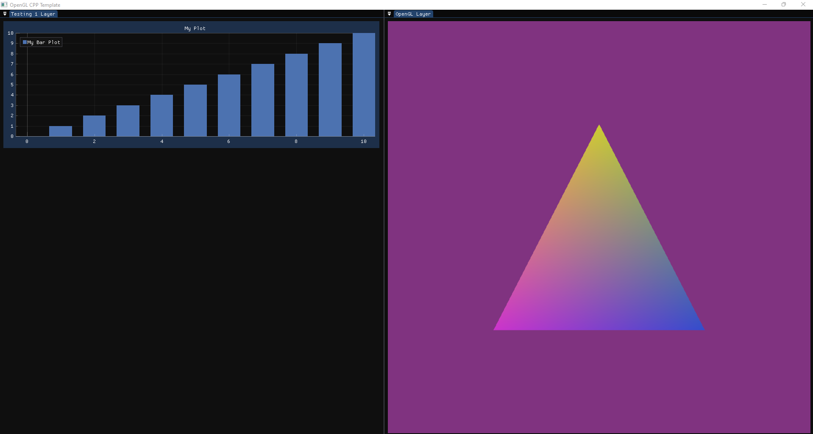

# Project template for creating opengl programs

I'm just playing with opengl. This little experiment is supposed to help me improve my understanding of computrer graphics.

# Screenshots







# How to use

```console
$ git clone --recurse-submodules git@github.com:ckacquah/Kontomire-Rendering-Engine.git
$ cd Kontomire-Rendering-Engine
$ mkdir build
$ cd build
$ cmake ../
```

# Dependencies

- GLAD
- GLFW
- GoogleTest
- Imgui
- Implot
- GLM
