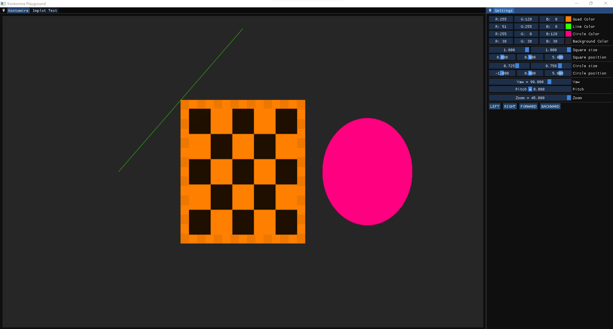

# Project template for creating opengl programs

I'm just playing with opengl. This little experiment is supposed to help me improve my understanding of computrer graphics.

# Screenshots




# How to use

```console
$ git clone --recurse-submodules git@github.com:ckacquah/kontomire.git
$ cd kontomire
$ mkdir build
$ cd build
$ cmake ../
```

# Dependencies

- GLAD
- GLFW
- GoogleTest
- Imgui
- Implot
- GLM
